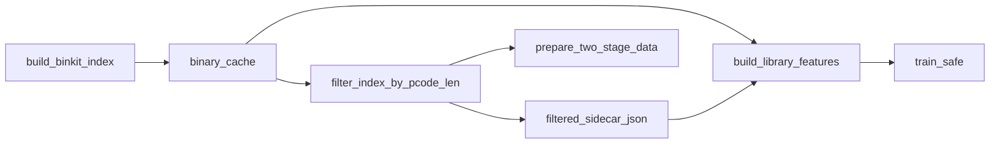

# Filter 侧车特征数据流

## 目标

在过滤阶段复用同一次 `multimodal` 提取结果，输出可选侧车文件 `{function_id: multimodal}`，供 `build_library_features` 直接命中，减少重复特征提取。

## 契约冻结

- `function_id`：`{binary_path}|{entry_address}`，其中 `binary_path` 为相对项目根路径，`entry_address` 统一为小写 `0x` 前缀。
- 侧车值结构：与 `library_features.json` 保持一致，必须包含：
  - `graph`: `num_nodes`, `edge_index`, `node_list`, `node_features`
  - `sequence`: `pcode_tokens`, `jump_mask`, `seq_len`

侧车默认使用 **JSONL**（每行 `{"function_id":"...","multimodal":{...}}`），过滤时流式写出、构建特征时只读入当前库/查询索引中出现的 `function_id`，避免在内存中持有整库 map 导致 OOM。若库极小且需要单文件对象，可用 `--filtered-features-format json`（不推荐大库）。

## 数据流



## 关键调用点

- `filter_index_by_pcode_len`
  - 每个二进制先 `peek_binary_cache`，未命中再 `run_ghidra_analysis`。
  - 子进程 `_pcode_filter_worker` 提取一次 `multimodal`，保留分支直接返回该对象并写入侧车 map。
- `build_library_features`
  - 先加载 `--precomputed-multimodal`。
  - 命中 `function_id` 时直接写输出，未命中才回退 `extract_multimodal_from_lsir_raw`。
- `PairwiseFunctionDataset`（训练可选）
  - 支持 `precomputed_features_path`，`_get_features` 优先读全局 map，缺失再动态提取。

## 推荐命令

```text
python scripts/filter_index_by_pcode_len.py \
  -i data/binkit_functions.json \
  -o data/binkit_functions_filtered.json \
  --filtered-features-output data/two_stage/filtered_features.jsonl

python scripts/prepare_two_stage_data.py --index-file data/binkit_functions_filtered.json

python scripts/build_library_features.py \
  --library-index data/two_stage/library_index.json \
  --query-index data/two_stage/query_index.json \
  --precomputed-multimodal data/two_stage/filtered_features.jsonl
```

侧车文件可能较大（与保留函数数量近似线性增长），建议按任务结束后清理或归档。

大程序内存上限、`RLIMIT_AS`、`systemd-run MemoryMax` 等见 [memory_and_oom.md](memory_and_oom.md)。
