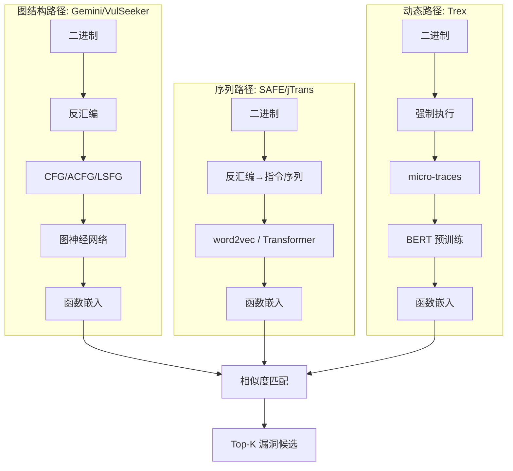

# 基于语义对比的固件漏洞分析技术研究：现状综述

## 摘要

随着物联网设备的广泛部署，固件安全已成为网络空间安全的关键防线。基于语义对比的漏洞分析技术通过比较二进制代码的语义相似性，能够有效发现跨架构、跨平台的已知漏洞（1-day漏洞）复现。本文系统梳理该领域的研究脉络，从传统特征匹配到基于深度学习的语义嵌入，重点分析代表性工作（discovRE, Genius, Gemini, VulSeeker, SAFE, jTrans, Trex, CRABS-former, PDG2Vec等）的核心思想与演进逻辑。归纳该领域的评估体系、基准数据集（BinCodex, BCSA, BinKit, CEBin, FirmVulLinker等）及关键挑战，并在此基础上提出潜在的研究方向与创新路径，为后续毕业设计工作奠定基础。然而，现有方法在应对真实固件环境中常见的编译优化差异、代码混淆及架构多样性时，其语义泛化能力和鲁棒性仍面临严峻挑战，且模型的可解释性与检测效率之间的矛盾日益突出。

**关键词**：固件安全；二进制代码相似性；语义对比；BCSD；1-day 漏洞

## 1 引言

固件作为物联网设备的"灵魂"，其安全性直接关系到物理世界与信息系统的交互可信。然而，固件供应链的复杂性（代码复用、第三方库引入）导致大量已知漏洞在不同厂商、不同设备间重复出现。在学术上，此类因复用含有漏洞的代码而产生的同源漏洞被称为"重现型漏洞"（recurring vulnerability），其根据成因可分为复用实际代码、API误用和复用抽象语义三类。本研究主要聚焦于第一类，即在二进制层面检测由相同代码复用导致的已知漏洞。基于语义对比的漏洞检测技术旨在通过度量二进制代码之间的语义相似性，将已知漏洞特征迁移至未知固件中，从而高效地发现同源漏洞。

近年来，该领域经历了从手工特征工程到深度表示学习的范式转变。本文聚焦于二进制代码相似性检测（Binary Code Similarity Detection, BCSD）这一核心技术，梳理其发展脉络、评估方法与现有局限，旨在为"基于语义对比的固件漏洞分析"的毕业设计提供坚实的文献基础和研究方向指引。需要指出的是，BCSD 在安全领域的应用可溯源至软件工程中的代码克隆检测，特别是 Type-4（语义克隆）检测，后者为跨平台、跨编译的语义相似性度量提供了理论铺垫。

## 2 研究现状

根据技术演进路径，可将现有工作划分为三个阶段：语法级匹配与图结构搜索、基于图神经网络的嵌入学习、基于语义融合的深度表示。这种演进本质上是从**"特征工程"向"表示学习"**的范式转移。

### 2.1 语法级匹配与结构搜索

早期工作以Costin等[1]为代表，首次对大规模固件镜像进行自动化分析，通过模糊哈希进行文件级相似性匹配，证明了同源性分析在漏洞发现中的可行性。但其依赖语法特征，难以应对跨架构、跨编译选项的场景。

为解决跨架构问题，discovRE[2]引入控制流图（CFG）结构，通过提取数值特征进行粗筛，再以最大公共子图同构进行精确比对，实现了跨x86/ARM/MIPS的漏洞函数搜索。然而，手工特征的设计依赖于专家知识，且MCS计算开销较大。

Genius[3]进一步提出属性控制流图（ACFG），为基本块附加统计特征，并通过聚类将ACFG压缩为固定长度的向量（指纹），极大提升了大规模搜索的效率。这一工作启发了后续基于图嵌入的思路。

**小结**：本阶段的特点是特征是**人为定义**的，依赖专家知识驱动，属于典型的特征工程范式。

### 2.2 基于图神经网络的嵌入学习

深度学习技术的引入使得特征学习自动化成为可能。Gemini[4]首次采用structure2vec图神经网络对ACFG进行端到端嵌入学习，配合孪生网络训练，在准确性和速度上均超越Genius。它标志着该领域正式进入表示学习时代。

VulSeeker[5]在Gemini基础上融合了数据流信息，构建标记语义流图（LSFG），将控制流与数据流统一建模，进一步增强了语义捕捉能力。其增强版VulSeeker-pro引入模拟执行验证，提升了检测精度。PDG2Vec[9]则进一步将语义粒度细化至变量级，基于程序依赖图（PDG）提取函数特征，通过判断两函数能否相互表示来评估相似性；在模拟固件供应链场景下，其AUC值平均比基线方法高出16%，代表了更精细语义建模的探索。

与此同时，SAFE[6]另辟蹊径，将函数视为指令序列，利用word2vec和自注意力机制学习语义嵌入，完全放弃图结构，展现了NLP方法在该领域的潜力。实验表明，SAFE的嵌入向量能有效聚类功能相似的函数。

**小结**：本阶段的特点是特征是**网络学习**的（数据驱动），但学习的目标仍是图结构或指令序列的表层表示，尚未深入代码的内在逻辑语义。

与直接处理汇编的路线并行，另一类工作致力于将二进制 lifting 到统一的中间表示（IR），如 VEX IR、Ghidra P-Code，以从根本上消除指令集架构（ISA）的差异。例如 VexIR2Vec 基于 VEX IR 提取语义特征。基于 IR 的方法虽可能面临 lifting 过程的信息丢失，但其架构中立性为构建通用模型提供了极具潜力的基础。

### 2.3 基于语义融合的深度表示

近年来，研究者开始探索如何融合结构、序列、动态行为等多维语义。jTrans[7]提出跳变感知Transformer，在位置编码中融入控制流跳转信息，使模型既能捕获指令序列上下文，又能感知程序结构，在BinaryCorp数据集上将准确率从32.0%提升至62.5%。它代表了当前静态分析路径的SOTA。

CRABS-former[10]在跨架构场景下对上述方向做了专门优化：针对汇编代码特点设计了归一化策略和跨架构分词器，以更好地处理不同指令集架构（ISA）的输入。在跨架构、跨编译器、跨优化选项的任务上，其Top-10召回率相对SAFE、jTrans分别提升约10.85%、18.02%和3.33%，展现出在跨架构难题上的进一步突破。

Trex[8]则从动态执行视角切入，通过强制执行收集函数的微轨迹（micro-traces），利用BERT类模型学习近似执行语义，在真实固件中发现14个CVE漏洞。该方法与静态分析形成互补，揭示了"语义"的多种定义可能。

此外，近期出现的VexIR2Vec、CEBin等工作进一步探索了基于中间表示（IR）的架构中立表示，以及两阶段"粗筛-精排"框架；FirmVulLinker[11]等则提出固件级五维语义建模（解包签名、文件系统语义、接口暴露、边界二进制符号、敏感参数调用链），超越传统函数/组件粒度，这些都为未来研究提供了新思路。通用大语言模型（如 CodeLlama、ChatGPT）在代码理解上的能力正在快速提升，未来可能用 LLM 生成代码的"语义摘要"或直接进行相似性判断，为该领域带来新的机遇。

**小结**：本阶段的特点是模型开始尝试理解**代码的内在逻辑**（语义），而不仅仅是结构。Trex 的动态执行、jTrans 的跳变感知、CRABS-former 的跨架构归一化，可统一归纳为**从静态结构相似性向动态/逻辑语义相似性的跃迁**。

表 1：代表性工作核心特点对比

| 工作 | 年份 | 输入特征 | 核心技术 | 支持跨架构 | 是否处理编译优化差异 | 是否开源 | 粒度 | 优点 | 局限性 |
|------|------|----------|----------|------------|----------------------|----------|------|------|--------|
| Costin[1] | 2014 | 文件内容 | 模糊哈希 | 否 | 否 | 否 | 文件级 | 大规模分析先驱 | 语法级，无语义理解 |
| discovRE[2] | 2016 | CFG数值特征 | MCS+特征过滤 | 是 | 否 | 否 | 函数级 | 跨架构识别 | 手工特征，计算开销大 |
| Genius[3] | 2016 | ACFG | 图嵌入+哈希 | 是 | 否 | 是 | 函数级 | 可扩展性好 | 非端到端，聚类依赖 |
| Gemini[4] | 2017 | ACFG | structure2vec+孪生网络 | 是 | 否 | 是 | 函数级 | 端到端学习，速度快 | 主要依赖结构，忽略数据流 |
| VulSeeker[5] | 2018 | LSFG (CFG+DFG) | 图神经网络 | 是 | 否 | 是 | 函数级 | 融合数据流，语义更丰富 | 主要是将控制流和数据流特征拼接，缺乏对二者交互关系的深度建模 |
| SAFE[6] | 2019 | 指令序列 | word2vec+自注意力 | 是 | 否 | 是 | 函数级 | 无需图构造，计算高效 | 忽略控制流结构 |
| jTrans[7] | 2022 | 指令序列+跳转 | Transformer+跳变位置编码 | 是 | 否 | 是 | 函数级 | 融合结构与序列，精度领先 | 模型复杂，开销较大 |
| Trex[8] | 2022 | 执行轨迹 | BERT+迁移学习 | 是 | 部分 | 是 | 函数级 | 动态语义，可解释性强 | 依赖执行，路径爆炸风险 |
| PDG2Vec[9] | 2024 | 程序依赖图(PDG) | 图嵌入+变量级语义 | 是 | 否 | 否 | 函数级 | 语义粒度更细，供应链场景表现好 | 构建PDG复杂度较高 |
| CRABS-former[10] | 2024 | 归一化汇编序列 | Transformer+跨架构分词器 | 是 | 是 | 否 | 函数级 | 专门针对跨架构优化，召回率高 | 依赖汇编归一化质量 |
| FirmVulLinker[11] | 2025 | 五维固件特征 | 多维语义建模 | 是 | 否 | 是 | 固件级 | 固件级语义，粒度创新 | 依赖固件解包与元数据提取 |

### 2.4 开源项目与实现流程

以下工作已开源，可直接复现与扩展。附 GitHub 链接及典型实现流程示意。

| 工作 | 开源仓库 | 实现要点 |
|------|----------|----------|
| Genius[3] | [Yunlongs/Genius](https://github.com/Yunlongs/Genius)、[qian-feng/Gencoding](https://github.com/qian-feng/Gencoding) | IDA 提取 ACFG →  spectral clustering 生成 codebook → VLAD/Bag-of-Features 编码 → kNN 检索 |
| Gemini[4] | [xiaojunxu/dnn-binary-code-similarity](https://github.com/xiaojunxu/dnn-binary-code-similarity)、[Yunlongs/Gemini](https://github.com/Yunlongs/Gemini) | IDA 提取 ACFG → structure2vec GNN → 孪生网络训练 → 向量距离度量相似性 |
| VulSeeker[5] | [buptsseGJ/VulSeeker](https://github.com/buptsseGJ/VulSeeker) | IDA + miasm2 构建 LSFG（CFG+DFG）→ 修改版 structure2vec 迭代 → 函数嵌入 → 余弦相似度 |
| SAFE[6] | [gadiluna/SAFE](https://github.com/gadiluna/SAFE) | 汇编指令 → Instruction2Vec (word2vec) → 自注意力 RNN 聚合 → 函数嵌入 |
| jTrans[7] | [vul337/jTrans](https://github.com/vul337/jTrans) | IDA 提取指令+跳转边 → 跳变感知 tokenization → Transformer 预训练+微调 → 嵌入 |
| Trex[8] | [CUMLSec/trex](https://github.com/CUMLSec/trex) | 强制执行 → 采集 micro-traces → 分层 Transformer 无监督预训练 → 微调匹配 |
| FirmVulLinker[11] | [a101e-lab/FirmVulLinker](https://github.com/a101e-lab/FirmVulLinker) | 固件解包 → 五维语义画像（解包序列、文件系统、接口、符号、调用链）→ 多维相似度融合 |

**说明**：Costin[1]、discovRE[2]、PDG2Vec[9]、CRABS-former[10] 暂未发现官方公开实现。此外，[w3i1ong/binsim](https://github.com/w3i1ong/binsim) 整合了 Gemini、SAFE、jTrans 等多种模型，支持 BinaryNinja/IDA，便于统一对比实验。

**典型实现流程（以函数级 BCSD 为例）**：

- **图结构路径**：二进制 → CFG/ACFG/LSFG → 图神经网络（structure2vec）→ 嵌入
- **序列路径**：汇编指令序列 → word2vec/Transformer（含跳变位置编码）→ 嵌入
- **动态路径**：强制执行 → micro-traces → BERT 预训练 → 嵌入

## 3 评估方法与基准数据集

### 3.1 评估任务与指标

该领域通常采用以下评估任务：

- **函数配对（function pairing）**：给定查询函数，从目标库中检索最相似的函数。
- **1-day漏洞检测**：以已知漏洞函数为查询，在目标固件中搜索同源漏洞函数。

常用指标包括：

- **Precision@k、Recall@k**：前k个结果中的正确比例与覆盖率。
- **MRR（Mean Reciprocal Rank）**：第一个正确结果的排名倒数均值。
- **ROC/AUC**：区分相似与不相似函数的整体能力。
- **MAP（Mean Average Precision）**：检索系统的平均精度。

近年来，研究者强调在挑战性场景下的评估，如跨优化选项（-O0 ~ -O3）、跨编译器/版本、跨架构、代码混淆等。在这些场景下，现有方法往往性能显著下降。

### 3.2 基准数据集

长期以来，该领域缺乏统一的数据集，导致不同工作难以公平比较。近期涌现了一批高质量基准。**获取这些基准是开展评估的重要前置任务**，下表汇总各数据集的获取方式与链接。

| 数据集 | 简介 | 获取方式 | 链接 |
|--------|------|----------|------|
| **BinCodex** | 综合性多层级数据集，包含系统软件、编译器、库函数、固件等，覆盖不同平台、编译器、优化选项及多种混淆技术，用于评估 8 种 SOTA 工具。研究发现，大多数工具在面对非默认优化选项和过程间混淆时表现不佳。 | 论文发表于 TBench 2024，数据获取链接待论文/附录确认，可联系作者或查阅补充材料。 | — |
| **BinKit** (BCSA Benchmark) | 二进制代码相似性分析（BCSA）基准。8 架构×6 优化×23 编译器，约 37 万二进制。含 Normal、Obfus、PIE、LTO 等子集，支持跨优化、跨架构、混淆评估。 | 仓库可克隆；预编译数据集需从 Google Drive 下载。编译脚本可本地生成自定义配置。 | [SoftSec-KAIST/BinKit](https://github.com/SoftSec-KAIST/BinKit)|
| **CEBin** | 清华大学团队 ISSTA 2024 提出的 1-day 漏洞检测基准，基于真实漏洞构建，首个面向 1-day 漏洞检测的精确评估方案。 | 代码与基准随论文开源，含 tokenization、预训练、微调、vulsearch 等模块。 | [hustcw/cebin](https://github.com/hustcw/cebin) |
| **FirmVulLinker Dataset** | 54 个固件镜像、74 个已验证漏洞，专注固件级同源漏洞评估。含仿真环境、部署脚本与自动化验证工具。 | 与 FirmVulLinker 框架一并发布，数据集随 [FirmVulLinker 仓库](https://github.com/a101e-lab/FirmVulLinker) 或论文补充材料提供。 | [a101e-lab/FirmVulLinker](https://github.com/a101e-lab/FirmVulLinker) |
| **BinaryCorp** (jTrans) | jTrans 论文发布的多样化二进制数据集，用于评估 BCSD 方法。 | 随 [jTrans 仓库](https://github.com/vul337/jTrans) 或论文 Artifact 提供。 | [vul337/jTrans](https://github.com/vul337/jTrans) |
| **Trex 数据集** | 跨架构、跨优化、跨混淆的函数级匹配评估数据。 | 预训练模型与样本数据随 [CUMLSec/trex](https://github.com/CUMLSec/trex) 提供。 | [CUMLSec/trex](https://github.com/CUMLSec/trex) |

**说明**：BinKit 即 BCSA Benchmark 的主流实现，二者常并称。BinCodex 数据获取尚需从论文/作者渠道确认，在获取困难时可使用 BinKit 作为替代进行跨优化、跨架构等场景的评估。

## 4 现有方法的局限性与挑战

综合现有工作，可归纳出以下核心挑战：

1. **单一视角的局限**：结构、数据流、序列、动态行为各自捕捉程序的一个侧面，但如何有效融合多源异构信息仍待探索。简单拼接往往引入噪声，且缺乏理论指导。

2. **鲁棒性不足**：如BinCodex评估所示，现有方法在非默认优化选项和过程间混淆下性能显著下降，难以应对真实固件的复杂编译环境。

3. **效率与精度的权衡**：基于Transformer的模型（如jTrans）精度高，但推理开销大；轻量级模型（如SAFE）效率高但精度有限。如何设计可扩展的精确模型是重要方向。

4. **架构中立性的挑战**：大多数方法依赖特定指令集汇编，难以无缝跨架构迁移。基于中间表示（IR）的方法虽能归一化输入，但IR的生成可能引入信息丢失；CRABS-former等工作表明，对原始汇编进行精细归一化（如归一化寄存器、操作数、指令）并结合跨架构分词器，是除IR之外的另一种可行路径，二者可并列探索。

5. **可解释性问题**：深度嵌入模型的黑箱特性使得检测结果难以解释，增加了漏洞验证的人工成本。

## 5 未来研究方向与拟开展工作

基于上述分析，本毕业设计拟在现有研究基础上，探索以下创新路径之一（或组合）。各方向与第 4 部分挑战的对应关系如下。

### 5.1 多维语义深度融合（针对挑战1、挑战4部分问题）

借鉴VulSeeker融合CFG与DFG的思路，结合jTrans的Transformer架构，设计能够同时建模图结构、基本块内数据流、指令序列的端到端模型。拟引入跨模态注意力机制，使不同语义特征相互增强，生成更全面的函数嵌入。FirmVulLinker提出的五维固件语义建模（解包签名、文件系统语义、接口暴露、边界二进制符号、敏感参数调用链）为此方向提供了可操作范例，可探索从函数级到固件级的多粒度语义融合。

### 5.2 两阶段"粗筛-精排"框架（针对挑战3）

参考discovRE的两阶段思想，但采用现代技术升级：第一阶段用轻量级模型（如SAFE或基于卷积的字节级embedding模型）实现快速检索，召回Top-K候选；第二阶段用更精细的jTrans类模型或基于IR的精细模型进行重排序。该框架有望在保持大规模可扩展性的同时，提升最终检测精度。

### 5.3 基于架构中立表示的学习（针对挑战4）

实现跨架构通用性可从两条技术路线入手：（1）利用反编译中间表示（如Ghidra P-Code、VEX IR）消除架构差异，在此基础上设计规范化流程，减少编译器优化引入的噪音；（2）对原始汇编进行精细归一化（如寄存器/操作数/指令归一化）并结合跨架构分词器，在归一化汇编序列上应用先进模型。CRABS-former的实践表明，第二条路线在跨架构、跨编译器、跨优化场景下同样有效。可在此基础上设计规范化IR或汇编流程，随后应用序列或图模型学习函数语义，实现真正的跨架构通用性。

### 5.4 面向鲁棒性与可解释性的检测（针对挑战2、挑战5）

探索如何让模型关注编译优化或混淆难以改变的语义核心，例如关键的系统调用序列、核心数据流模式（即"程序骨架"）。可尝试使用对比学习，让模型拉近同一程序不同编译版本的距离、推远不同程序的距离，从而学习到对编译优化鲁棒的表示。同时，利用注意力机制可视化，指出模型是依据代码的哪一部分判定为相似的，为安全分析师提供可解释的"证据"。

### 5.5 评估与验证

计划在公开基准（如BinCodex、CEBin、BinKit、FirmVulLinker Dataset）上进行全面评估，重点关注跨优化、跨架构、混淆等挑战性场景。拟采用 **BinKit** 作为二进制相似性基准，基于 **Ghidra P-code / LSIR** 实现架构中立表示与 CFG 匹配，与Gemini、jTrans、CRABS-former等SOTA方法进行对比，验证所提方法的有效性。

## 6 结论

本文系统综述了基于语义对比的固件漏洞分析技术研究现状，梳理了从语法匹配到深度语义融合的演进历程，总结了代表性工作的核心思想、优缺点及评估体系，并补充了CRABS-former、PDG2Vec、FirmVulLinker等近期工作。当前研究在精度上已取得长足进步，但仍面临多维语义融合、鲁棒性、效率与可解释性等挑战。基于此，本文提出了多个可能的创新方向作为毕业设计的切入点。后续工作将聚焦于【5.2 两阶段框架】的设计与实现，旨在构建一个兼具高精度与高可扩展性的固件漏洞检测原型系统，并通过在 BinCodex 等权威基准上与 jTrans 等 SOTA 工具的对比，验证其在处理编译优化差异这一关键难题上的有效性。

## 参考文献

以下链接均为可直接访问的网页（PDF 或摘要页）。部分会议论文同时提供 arXiv 预印本，便于无订阅读者获取全文。

[1] Costin A, Zaddach J, Francillon A, et al. A large-scale analysis of the security of embedded firmwares[C]//Proceedings of the 23rd USENIX Security Symposium. San Diego, CA, USA, 2014: 95-110. <https://www.usenix.org/system/files/conference/usenixsecurity14/sec14-paper-costin.pdf>

[2] Eschweiler S, Yakdan K, Padilla E. discovRE: Efficient cross-architecture identification of bugs in binary code[C]//Proceedings of the 23rd Network and Distributed System Security Symposium (NDSS). San Diego, CA, USA, 2016. <https://www.ndss-symposium.org/wp-content/uploads/2017/09/discovre-efficient-cross-architecture-identification-bugs-binary-code.pdf>

[3] Feng Q, Wang M, Cheng Y, et al. Scalable graph-based bug search for firmware images[C]//Proceedings of the 2016 ACM SIGSAC Conference on Computer and Communications Security. Vienna, Austria, 2016: 480-491. <https://dl.acm.org/doi/10.1145/2976749.2978370>

[4] Xu X, Liu C, Feng Q, et al. Neural network-based graph embedding for cross-platform binary code similarity detection[C]//Proceedings of the 2017 ACM SIGSAC Conference on Computer and Communications Security. Dallas, TX, USA, 2017: 363-376. <https://arxiv.org/abs/1708.06525>

[5] Xu Z, Chen B, Zhang C, et al. VulSeeker: A semantic learning based vulnerability seeker for cross-platform binary[C]//2018 33rd IEEE/ACM International Conference on Automated Software Engineering (ASE). Montpellier, France, 2018: 896-899. <https://ieeexplore.ieee.org/document/9000027>

[6] Massarelli L, Di Luna G A, Petroni F, et al. SAFE: Self-attentive function embeddings for binary similarity[C]//International Conference on Detection of Intrusions and Malware, and Vulnerability Assessment (DIMVA). Milan, Italy, 2019: 309-329. <https://arxiv.org/abs/1811.05296>

[7] Wang H, Qu W, Katz G, et al. jTrans: Jump-aware transformer for binary code similarity detection[C]//Proceedings of the 31st ACM SIGSOFT International Symposium on Software Testing and Analysis (ISSTA). New York, NY, USA, 2022: 1-13. <https://arxiv.org/abs/2205.12713>

[8] Pei K, Xuan Z, Yang J, et al. Trex: Learning execution semantics from micro-traces for binary similarity[J]. IEEE Transactions on Software Engineering, 2023. <https://arxiv.org/abs/2012.08680>

[9] Zhang Y, Fang B, Xiong Z, et al. A semantics-based approach on binary function similarity detection (PDG2Vec)[J]. IEEE Internet of Things Journal, 2024, 11(15): 25910-25924. <https://pure.qub.ac.uk/en/publications/a-semantics-based-approach-on-binary-function-similarity-detectio>

[10] Cao Y, Zhang H, Liu Y, et al. CRABS-former: Cross-architecture binary code similarity detection based on transformer[C]//Proceedings of the 2024 International Symposium on Internetware (Internetware). 2024. <https://openreview.net/forum?id=C7pCwI1UrX>

[11] Cheng Y, Xu F, Xu L, et al. FirmVulLinker: Leveraging multi-dimensional firmware profiling for identifying homologous vulnerabilities in internet of things devices[J]. Electronics, 2025, 14(17): 3438. <https://www.mdpi.com/2079-9292/14/17/3438>
