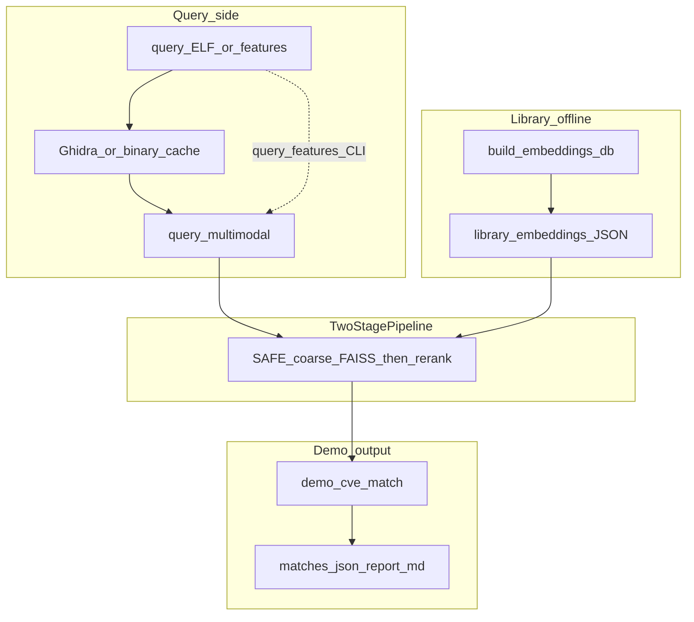

# SemPatch 架构与数据结构

## 开发流程强制规范

1. **写任何代码前**必须完整阅读 `memory-bank/@architecture.md`（包含完整数据结构）
2. **写任何代码前**必须完整阅读 `memory-bank/@design-document.md`
3. **每完成一个重大功能或里程碑后**，必须更新 `memory-bank/@architecture.md`

> 说明：SemPatch 为固件漏洞分析项目，无传统数据库；「数据结构」指 LSIR、Features、Embeddings、漏洞库 JSON 等 schema。

### 对外 CLI 与产品路径

| 入口 | 说明 |
|------|------|
| **`sempatch.py match`** | 唯一推荐产品入口：查询二进制或 `--query-features` → TwoStage（SAFE 粗筛 + 多模态精排）→ `matches.json` / `report.md` / `pipeline_status.json`。**硬依赖**：当前解释器须已安装 **PyTorch**；若使用 **`--query-binary`**，还须配置可用 **Ghidra**（`GHIDRA_HOME` / `analyzeHeadless`），否则入口以非 0 退出。`--max-queries` 默认 **0**（不限制），即对 `query_features` 中全部函数做匹配。可选 **`--match-filter`**：`top_k`（默认，按 `--top-k` 截断）、`unique`（最高分≥阈值且与次高分差>tie-margin）、`all_above`（所有≥阈值）；`--coarse-k` 默认 100，未出现在命令行时不视为显式指定——非 `top_k` 且未显式传入时会 **warning** 建议加大 K。 |
| **`./sempatch`（根目录）** | 委托 `sempatch.py`；白名单子命令 `match`/`compare`/`extract`/`unpack` 原样转发。若首参**非**子命令且为「可执行/ELF 文件 + 含 `library_features.json` 或 `library_safe_embeddings.json` 的目录」，则改写为 `match --query-binary <文件> --two-stage-dir <目录>`；否则单参数 legacy：`extract <binary>`。实现见 [`sempatch_argv.py`](../sempatch_argv.py)。 |
| `sempatch.py compare` | **legacy**：DAG 编排（`PIPELINE_STRATEGY` / `--strategy`），非 TwoStage 产品语义；**须可用 Ghidra**（与 `extract` 相同校验）。 |
| `scripts/run_cve_pipeline.py` | 侧链兼容，委托 `src/cli/cve_match.py`（与 `match` 同逻辑）。 |
| `scripts/demo_cve_match.py` | 侧链：直接调 `src/cli/two_stage_demo.run_demo`。 |
| `sempatch.py extract` | **[legacy]** 导出 `lsir_raw.json`；**须可用 Ghidra**，失败时非 0 退出。 |
| `scripts/sidechain/*` | 训练、评估、库构建等；`scripts/*.py` 同名桩转发至 `sidechain`，见 `scripts/sidechain/README.md`。 |
| `scripts/show_lsir_dfg.py` | 从 `lsir_raw.json` 调用 `build_lsir` 并打印单函数 **cfg/dfg** JSON 摘要（调试/验收）。 |

**路径配置（`sempatch.cfg` `[paths]` / `src/config.py`）**：产品数据与输出默认值由配置单源派生，CLI 显式参数优先。

| 配置键 | 环境变量（覆盖 cfg） | 默认 | 说明 |
|--------|----------------------|------|------|
| `data_dir` | `SEMPATCH_DATA_DIR` | `data` | 数据集与库根目录 |
| `two_stage_rel` | `SEMPATCH_TWO_STAGE_REL` | `two_stage` | 相对 `data_dir`；`match` 默认 `--two-stage-dir` = `<data_dir>/<two_stage_rel>` |
| `output_dir` | `SEMPATCH_OUTPUT_DIR` | `output` | 全局输出根 |
| `match_run_subdir` | `SEMPATCH_MATCH_RUN_SUBDIR` | `match_run` | 相对 `output_dir`；未指定 `--output-dir` 时 match 默认写入 `<output_dir>/<match_run_subdir>`（旧默认 `output/prototype_pipeline_run` 已弃用） |
| `binary_cache_dir` | `SEMPATCH_BINARY_CACHE_DIR` | `output/binary_cache` | `lsir_raw` 等缓存；留空可禁用 |
| `log_dir` | — | `<output_dir>/logs` | 日志目录 |
| `unpack_output_dir` | `SEMPATCH_UNPACK_DIR` | `output/unpacked` | 解包输出 |

代码中常量：`DATA_DIR`、`DEFAULT_TWO_STAGE_DIR`、`DEFAULT_TWO_STAGE_PATH`、`OUTPUT_DIR`、`DEFAULT_MATCH_OUTPUT_DIR`、`DEFAULT_MATCH_OUTPUT_PATH`、`BINARY_CACHE_DIR` 等（见 `src/config.py`）。

**侧链产物命名**：产品/验收目录可继续用语义化名称（如 `data/cve_quick_demo`、`output/cve_quick_demo_run`）。**新建**侧链实验或批量产物建议统一前缀 **`sc_`**（sidechain），例如 `output/sc_train_safe_20260328`、`data/sc_binkit_subset`，便于与产品默认路径区分。

**人造 CVE 离线验收**：`benchmarks/smoke/fake_cve/`（`FAKE-CVE-*` 库 JSON）+ `tests/test_fake_cve_match.py`；运行 `pytest -m fake_cve` 或 `make eval-smoke`（不依赖 `scripts/*` 子进程）。含 Ghidra 的多二进制样例见 `examples/fake_cve_demo/`。

**固化评测基准（三目录）**：根目录 [`benchmarks/`](../benchmarks/README.md) — `smoke/`（同上 + `smoke/two_stage` 供 `eval_two_stage` 最小输入）、`dev_binkit/`（固定清单与 `prepare_two_stage_data --seed 42` 划分；大体积特征在 `artifacts/`，默认 gitignore）、`real_cve/`（`eval_bcsd --mode cve` 的查询/库嵌入，默认 gitignore）。命令封装：`make eval-smoke`、`make eval-dev`、`make eval-real`（见根目录 `Makefile`）。

---

## 一、完整数据结构

### 1.1 LSIR / Ghidra 相关

**一二进制一 Ghidra**：全流程统一使用 extract_lsir_raw 一次性导出该二进制全部函数；lsir_raw 持久化于 BINARY_CACHE_DIR（键=binary_cache_key(path)），供 build_binkit_index、build_library_features、PairwiseFunctionDataset 复用；按需从缓存提取 multimodal 特征，避免重复 Ghidra 调用。

**按 pcode 预过滤索引**（`scripts/sidechain/filter_index_by_pcode_len.py`，根目录桩 `scripts/filter_index_by_pcode_len.py`）：按 `binary_abs` 分组串行处理，任意时刻仅驻留当前二进制的一份 `lsir_raw`；函数级特征提取在 Unix 上使用 `fork` 进程池并行，子任务仅携带单函数 LSIR 片段，避免跨二进制无界缓存导致 OOM、避免纯线程在 GIL 下无法吃满 CPU。启用 `--filtered-features-output` 时，默认输出 **JSONL 侧车**（逐行 `function_id` + `multimodal`），流式写出以降低内存峰值；可选 `--filtered-features-format json` 输出单文件对象（大库易 OOM）。脚本支持 checkpoint：每处理完一个 `binary_abs` 原子写入 `<output>.filter_checkpoint.json`，`--resume` 时校验 `input_sha256 / project_root / min_pcode_len / sidecar 路径` 及 **训练符号过滤相关 meta**（`exclude_runtime_symbols`、`extra_exclude_names`、`extra_exclude_prefixes`、`exclude_names_file_sha256`、`min_basic_blocks`、`exclude_getter_setter`、`exclude_libc_common`）；JSONL 在续跑时以 append 模式写入并采用「同 function_id 后写覆盖先写」语义。仅包含通过阈值且提取成功的函数。**清洗扩展**：`--min-basic-blocks`（`multimodal.graph.num_nodes` 代理基本块规模）、`--exclude-getter-setter`（get/set/is* 且序列/CFG 极短）、`--exclude-libc-common`（合并 `src/utils/libc_common_exact.txt`，默认开）。**训练符号过滤（默认开启）**：在 multimodal 提取前按函数名排除 `main`、`__libc_start_main` 等 CRT/启动胶水符号（规则与 API 见 `src/utils/training_function_filter.py`）；`--no-exclude-runtime-symbols` 关闭；`--exclude-names` / `--exclude-names-file` / `--extra-exclude-prefix` 可扩展。升级后旧 checkpoint 若校验失败，使用 `--fresh` 重跑。

| 类型 | 字段 | 说明 |
|------|------|------|
| LSIRInstruction | address, mnemonic, operands, pcode | 单条指令；pcode 为 P-code 操作列表 |
| LSIRBasicBlock | start, instructions | 基本块；instructions 为 LSIRInstruction 列表 |
| LSIRFunction | name, entry, basic_blocks, cfg, dfg | LSIR 函数；`cfg` 在 `include_cfg=True` 时添加；**`dfg` 在 `build_lsir` 后始终存在**（可为空图） |
| LSIRRaw | functions | Ghidra 原始输出；functions 为 LSIRFunction 列表（通常无 cfg/dfg） |
| LSIR | functions | 含 cfg 与 **必有 dfg** 的中间表示（dfg 可空） |

**DFG 构建语义**（[`src/utils/ir_builder.py`](../src/utils/ir_builder.py)）：DFG 节点为 `"{instruction_address}:{varnode_string}"`（varnode 为 P-code 的 `output`/`inputs` 原文）。在**基本块列表顺序**下按指令、再按单条指令内 P-code 顺序做 **reaching-def**：对每条带 `output` 的 P-code，对每个 `input` varnode 建边 **最近定值节点 → 当前 def 节点**；若路径上尚无该 varnode 的定值，则源为当前地址上的占位节点 `"{addr}:{input}"`（与历史节点 ID 一致）。**不建模 PHI/汇合**与非线性控制流上的精确汇合，跨分支精度为启发式。`build_lsir` 产出的每个函数 **始终包含 `dfg` 键**（`include_dfg=False` 时为空图，仅跳过边计算）。CFG 与 DFG 的节点 ID 空间**互不统一**（块 ID `bb_*` vs 地址+varnode）。

所有 TypedDict 使用 `total=False`，字段均为可选。

### 1.1a 5.3 / P-code 规范化契约

**一句话**：默认在构建 LSIR 或从 `lsir_raw` 提取 multimodal 之前对 P-code 做规范化（opcode 统一、varnode 格式与 `unique` 空间抽象），以实现跨编译差异下更稳定的序列表示；磁盘上的 `binary_cache` 仍保存 Ghidra 原始输出，规范化发生在消费端。

| 入口 | 模块 / 行为 |
|------|-------------|
| DAG `lsir_build` | `src/dag/nodes/lsir_build_node.py`：`normalize_pcode` 默认为 **True**，为真时在 `build_lsir` 前调用 `normalize_lsir_raw(..., abstract_unique=True, in_place=False)`。 |
| DAG `pcode_normalize`（可选） | `src/dag/nodes/pcode_normalize_node.py`：单独重写 `ctx["ghidra_output"]`；`abstract_unique` 默认 **True**。`build_pcode_normalize_node`（`src/dag/builders/fusion.py`）已导出，**当前默认 fusion 策略链未插入该节点**（规范化由 `lsir_build` 内联完成即可）。 |
| 共享提取 | `src/utils/feature_extractors/multimodal_extraction.py`：`extract_multimodal_from_lsir_raw` 在单函数子集上 **始终** `normalize_lsir_raw`（默认参数）后再 `build_lsir`。 |
| 训练数据集 | `src/features/dataset.py`：`PairwiseFunctionDataset._extract_features` 同样先 `normalize_lsir_raw` 再 `build_lsir`。 |
| 构建器默认值 | `src/dag/builders/fusion.py`：`build_lsir_build_node(..., normalize_pcode=True)`。 |

**默认值**：`normalize_pcode=True`（LSIR 节点 / builder）；`abstract_unique=True`（规范化 API 与 `PcodeNormalizeNode`）；`normalize_lsir_raw` 默认 `in_place=False`（深拷贝，不污染缓存中的原始 dict 引用路径取决于调用方是否复用同一对象）。

**binary_cache**：`write_to_binary_cache` 写入的是 **未规范化** 的 `lsir_raw.json`；规范化在从缓存读出后的 LSIR 构建或特征提取路径执行（见上表）。

**关闭与边界**：将 `lsir_build` 的 `normalize_pcode` 设为 **False** 可跳过 DAG 路径上的规范化。未列入 `OPCODE_ALIASES` 的 opcode：经 `strip().upper()` 后原样保留。无法被 `pcode_normalizer` 中正则解析的 varnode 字符串：**原样返回**。重复规范化对已规范化的典型输出通常稳定（如 `unique` 已为 `(unique,0x0,size)`）。


### 1.2 特征与嵌入

| 类型 | 字段 | 说明 |
|------|------|------|
| FeaturesItem | name, features | 单个函数的特征；features 为融合后的多模态结构 |
| FeaturesDict | functions | 特征字典；functions 为 FeaturesItem 列表 |
| EmbeddingItem | name, vector, cve | 单个函数的嵌入；vector 为浮点列表；cve 为可选字符串列表（`List[str]`） |
| EmbeddingDict | functions | 嵌入字典；functions 为 EmbeddingItem 列表 |

### 1.3 多模态特征格式（fuse_features 输出）

`FeaturesItem.features` 中 `multimodal` 结构：

| 子键 | 说明 |
|------|------|
| graph | num_nodes, edge_index, node_list, node_features（CFG/ACFG 派生，控制流） |
| dfg | 与 `graph` **同 schema**：`num_nodes`, `edge_index`, `node_list`, `node_features`；节点特征为稳定哈希得到的 **整数 id**（供 DFG 节点嵌入表使用）；无数据时为**空图** |
| sequence | pcode_tokens, jump_mask, seq_len |

#### 1.3a Survey 5.1 与嵌入路径（阶段 H 后摘要）

| 文件 / 符号 | 在 5.1 叙事中的角色 |
|-------------|---------------------|
| `src/utils/feature_extractors/fusion.py`（`fuse_features`） | 将 CFG 图、**DFG 子图**与 P-code 序列合并为 `multimodal`（`graph` + `dfg` + `sequence`）；`include_dfg=False` 时可省略 `dfg` 键（兼容旧调用） |
| `src/features/models/multimodal_fusion.py`（`MultiModalFusionModel`） | CFG 图分支 + **DFG 图分支**（`use_dfg=True` 时）拼接后经 `graph_fuse` 压回维度，再与序列做跨模态注意力 |
| `src/features/inference.py`（`embed_batch`） | 解析检查点 `{state_dict, meta}` 或裸 `state_dict`；按 `meta.use_dfg` 或权重键构造模型并推理 |
| `src/features/baselines/safe.py`（`embed_batch_safe`） | **仅序列**侧嵌入（与精排多模态不同结构）；两阶段粗筛与 `train_safe.py` 同族 |
| LSIR / `extract_graph_features` | 从 LSIR 提取 CFG 与 DFG **统计**子图；`fuse_features` 将 DFG 化为 `multimodal.dfg` |

### 1.4 模糊哈希

| 类型 | 字段 | 说明 |
|------|------|------|
| FuzzyHashItem | name, hash, algorithm | algorithm 为 "ssdeep" 或 "tlsh" |
| FuzzyHashDict | functions | 模糊哈希字典 |

### 1.5 CFG 签名

| 类型 | 字段 | 说明 |
|------|------|------|
| CFGSigItem | name, num_nodes, num_edges, edges, node_list | CFG 结构签名 |
| CFGSigDict | functions | CFG 签名字典 |

### 1.6 匹配结果

| 类型 | 字段 | 说明 |
|------|------|------|
| DiffMatchItem | firmware_func, db_func, similarity, method, mcs_ratio | 单条匹配记录 |
| DiffResult | matches | 差分/匹配结果；matches 为 DiffMatchItem 列表 |

### 1.6a CVE match 产物（TwoStage / `run_demo`）

`matches.json` 中每条 query 推荐字段：

| 字段 | 说明 |
|------|------|
| match_status | 枚举 **`ok`** / **`no_credible_match`**（与 `report.md` 一致） |
| filter_meta | 与 `candidates` **平级**；含 `mode`（`top_k` / `unique` / `all_above` / `coarse_only_safe`）、`reranked_count`、`reject_reason`（`below_threshold` / `tied_top` / `no_candidates` / null）、阈值模式下 `min_similarity` 与 `tie_margin`、诊断用 `max_similarity` / `second_similarity`；粗筛降级时 `threshold_filter_applied: false` |
| candidates | 策略通过后的列表（`top_k` 模式为截断后的前 K 条） |
| top_k | 仅 `match_filter=top_k` 时有意义；否则 JSON 中为 `null` |

**策略（精排分数已按相似度降序，`s0` 最高）**：

- **top_k**：取前 `min(top_k, n)` 条，无相似度阈值。
- **unique**：`ranked` 空 → `no_candidates`；`s0 < min_similarity` → `below_threshold`；若存在 `s1` 且 `s0 - s1 <= tie_margin` → `tied_top`；否则仅输出第一名。
- **all_above**：输出所有 `si >= min_similarity`，相对全量精排序保持顺序。

`TwoStagePipeline` 仅负责全量精排；过滤在 `src/cli/two_stage_demo.py`（`filter_ranked_by_policy` / `apply_output_policy`）。阈值与唯一性为启发式，不保证 CVE 正确。

---

## 二、节点输入输出键映射

### NODE_INPUT_KEYS

| 节点类型 | 输入键 |
|----------|--------|
| ghidra | （无，入口） |
| pcode_normalize | ghidra_output |
| lsir_build | ghidra_output |
| feature_extract | lsir |
| embed | features |
| load_db | （无，从配置加载） |
| diff | embeddings, db_embeddings |
| unpack | （无） |
| fuzzy_hash | lsir |
| cfg_match | lsir, db_lsir |
| acfg_extract | lsir |
| graph_embed | acfg_features |
| diff_faiss | embeddings, db_embeddings |
| diff_bipartite | embeddings, db_embeddings |
| diff_fuzzy | fuzzy_hashes, db_fuzzy_hashes |

### NODE_OUTPUT_KEYS

| 节点类型 | 输出键 |
|----------|--------|
| ghidra | ghidra_output |
| pcode_normalize | ghidra_output |
| lsir_build | lsir |
| feature_extract | features |
| embed | embeddings |
| load_db | db_embeddings |
| diff | diff_result |
| unpack | unpack_dir |
| fuzzy_hash | fuzzy_hashes |
| cfg_match | diff_result |
| acfg_extract | acfg_features |
| graph_embed | embeddings |
| diff_faiss | diff_result |
| diff_bipartite | diff_result |
| diff_fuzzy | diff_result |

---

## 三、lsir_raw JSON 结构（Ghidra 输出）

顶层结构：

```
{
  "functions": [
    {
      "name": "<函数名>",
      "entry": "<入口地址十六进制>",
      "basic_blocks": [
        {
          "start": "<块起始地址>",
          "end": "<块结束地址>",
          "instructions": [
            {
              "address": "<指令地址>",
              "mnemonic": "<助记符>",
              "operands": "<操作数字符串>",
              "pcode": [
                {
                  "opcode": "<P-code 操作码>",
                  "output": "<(space, offset, size)>",
                  "inputs": ["<varnode>", ...]
                }
              ],
              "source_line": null,
              "source_file": null
            }
          ]
        }
      ]
    }
  ]
}
```

- 单条 P-code：`opcode`（如 INT_SUB、COPY、CBRANCH）、`output`（varnode 字符串）、`inputs`（varnode 列表）
- varnode 格式：`(space, offset, size)`，如 `(register, 0x20, 8)`、`(const, 0x8, 8)`、`(unique, 0x2c180, 8)`、`(ram, 0x105fd0, 8)`

---

## 四、漏洞库 JSON 格式

### 4.1 LSIR 格式

与 lsir_raw 相同结构，或已含 cfg/dfg 的 LSIR。

### 4.2 Embeddings 格式

```
{
  "functions": [
    {
      "name": "<函数名>",
      "vector": [0.5, -0.5, ...],
      "cve": ["CVE-2021-1234", "CVE-2022-5678"]
    }
  ]
}
```

- `vector`：固定维度浮点数组（由 MultiModalFusionModel 或基线决定）
- `cve`：可选字符串列表（`List[str]`），用于 1-day 漏洞评估；缺失时视为 `[]`

### 4.3 Fuzzy 格式

```
{
  "functions": [
    {
      "name": "<函数名>",
      "hash": "<ssdeep 或 tlsh 哈希串>",
      "algorithm": "ssdeep"
    }
  ]
}
```

### 4.4 MVP 本地验证（`examples/mvp_vulnerable`）

用于在单机上验证「含漏洞模式的 ELF → 漏洞库 → 匹配 / CVE 报告」：

| 步骤 | 说明 |
|------|------|
| 编译 | `examples/mvp_vulnerable/Makefile` → `vulnerable`（建议 `-fno-pie -no-pie`） |
| 路径 A（CFG） | `sempatch extract` → `scripts/build_vuln_db.py --filter vuln_` → `data/vulnerability_db/mvp_vuln_lsir.json`；`sempatch compare … --strategy traditional_cfg` → `diff_result.json` |
| 路径 B（CVE 报告，正式入口） | 生成库：`build_mvp_vulnerable_cve_library.py -o data/cve_quick_demo --unified-cve CVE-2018-10822 --write-library-safe-embeddings`；运行：`sempatch.py match --query-binary examples/mvp_vulnerable/vulnerable --two-stage-dir data/cve_quick_demo`（详见 `data/cve_quick_demo/README.md`）。侧链：`scripts/run_cve_pipeline.py` / `demo_cve_match.py`。 |
| 路径 C（多二进制伪 CVE 清单） | `scripts/build_fake_cve_demo_library.py --manifest <json> -o <dir> --write-library-safe-embeddings`：每项含 `binary`、`function_name`、`cve`（可为 `FAKE-CVE-*` 等任意字符串）、可选 `entry`；产出与路径 B 相同形态的 `library_features.json` + `library_safe_embeddings.json`，供 `sempatch match` / 侧链脚本。 |
| 路径 D（10 ELF 样例 + 一键脚本） | 目录 [`examples/fake_cve_demo/`](../examples/fake_cve_demo/)：`make` 生成 `build/vuln_fake_{01..10}.elf` 与 `build/query.elf`（与 `vuln_fake_05` 同源）；[`manifest.json`](../examples/fake_cve_demo/manifest.json) 绑定 `FAKE-CVE-0001` … `FAKE-CVE-0010`；[`run_demo.sh`](../examples/fake_cve_demo/run_demo.sh) 建库至 `data/fake_cve_demo_lib` 并跑 `sempatch.py match` → `output/fake_cve_demo_run`（说明见同目录 `README.md`）。 |

**依赖**：`networkx`（CFG 匹配）；`run_dag` 调用方须使用 `if ctx is None: ctx = {}`，勿对传入的空 `{}` 使用 `ctx or {}`（否则外部拿不到节点写入）。一键脚本：`scripts/run_mvp_vulnerable_demo.sh`。

### 4.5 自备漏洞二进制 → 漏洞库（生产形态）

不绑定任何单一公开基准包；输入为可 Ghidra 分析的 **ELF/共享库**（自行收集）。**.arrow / Parquet 等表格**若不含对应二进制，无法作为本仓库默认流水线输入（见 [`docs/VULNERABILITY_LIBRARY.md`](../docs/VULNERABILITY_LIBRARY.md)）。

| 步骤 | 脚本 / 产物 |
|------|-------------|
| 二进制清单 | `build_library_binary_index.py` → `vuln_library_binary_index.json`（`binary` + 空 `functions`） |
| 全函数索引 | `build_binkit_index.py --from-index-file …` → 全函数索引 JSON（与 BinKit 索引同 schema） |
| 特征与嵌入 | `build_library_features.py` → `library_features.json`；`build_embeddings_db.py --features-file --model safe` → `library_safe_embeddings.json` |
| CVE 元数据 | `annotate_library_embeddings_cve.py` + `cve_mapping.json` / `per_binary_cve` JSON / 路径推断 |

完整命令链与注意事项见 [`docs/VULNERABILITY_LIBRARY.md`](../docs/VULNERABILITY_LIBRARY.md)。**两阶段匹配**要求库特征键与嵌入 `function_id` 均为 `binary_rel|entry`，不可用仅按 `name` 键控的 `build_embeddings_db --index-file` 批量输出替代 `--features-file` 路径。

---

## 五、模块接口契约

| 层次 | 模块 | 输入 | 输出 |
|------|------|------|------|
| 提取层 | frontend (GhidraRunner) | 二进制路径 | lsir_raw JSON |
| 构建层 | utils/ir_builder | lsir_raw (可含规范化后) | LSIR (含 cfg, dfg) |
| 规范化 | utils/pcode_normalizer | lsir_raw | lsir_raw（规范化后） |
| 特征层 | utils/feature_extractors | LSIR 单函数 | graph_feats, seq_feats, acfg_feats |
| 融合层 | utils/feature_extractors/fusion | graph_feats, seq_feats, acfg_feats | FeaturesDict 兼容的融合结构 |
| 嵌入层 | features/inference | FeaturesDict | List[EmbeddingItem] |
| 匹配层 | matcher/* | embeddings / fuzzy_hashes / lsir | DiffResult |

---

## 六、lsir_raw 缓存与 skip 逻辑

### 6.1 binary_cache 为唯一持久化存储

- 路径：`{BINARY_CACHE_DIR}/{binary_cache_key(path)}/lsir_raw.json`
- `binary_cache_key` 由 `(abspath, mtime, size)` 的 SHA-256 前 32 位决定；二进制文件变更后缓存自动失效
- 所有需要 lsir_raw 的模块（build_binkit_index、build_library_features、filter_index_by_pcode_len、PairwiseFunctionDataset）均从 binary_cache 读取；未命中时才调用 Ghidra

### 6.2 skip 逻辑优先级（Plan B，从高到低）

1. **peek_binary_cache**（`_ghidra_helpers.peek_binary_cache`）：纯读，无任何 I/O 副作用，不创建目录；`return_dict=True` 时的首选路径
2. **can_skip_ghidra**：检查 output_dir 下 script_output_path 的 mtime；`return_dict=False` 时使用
3. **read_from_binary_cache**：缓存命中时将文件复制到 output_dir；`return_dict=False` 且 output_dir 已有时使用
4. **执行 Ghidra**：前三步均未命中时触发；结束后调用 `write_to_binary_cache` 更新缓存

### 6.3 --force 语义

`--force` 跳过 `peek_binary_cache`、`can_skip_ghidra`、`read_from_binary_cache` 三个 skip 路径，强制重新执行 Ghidra；执行后仍调用 `write_to_binary_cache` 以更新缓存。

### 6.4 temp 目录生命周期

| 模块 | session temp_dir | 子目录（如 v1/、lib_1/） |
|------|-----------------|--------------------------|
| build_binkit_index | `tempfile.mkdtemp()` 或 `--temp-dir`，脚本结束时删除 | 每个二进制处理完毕后立即删除（finally） |
| build_library_features | 同上 | 同上 |
| filter_index_by_pcode_len | 同上 | 同上 |
| PairwiseFunctionDataset | `cache_dir/ghidra_temp/`（不删除父目录） | 每个二进制 ghidra_temp 子目录，用毕立即删除（finally） |

缓存命中（peek_binary_cache 返回非 None）时，子目录不会被创建。

### 6.5 推荐流水线（binary_cache 复用说明）

```
build_binkit_index          → 填充 binary_cache（每个二进制调用一次 Ghidra）
filter_index_by_pcode_len   → 读 binary_cache（零 Ghidra 调用）
prepare_two_stage_data      → 纯索引操作，无 Ghidra
build_library_features      → 读 binary_cache（零 Ghidra 调用）
train_safe                  → PairwiseFunctionDataset 读 binary_cache（零 Ghidra 调用）
```

build_binkit_index 完成后，后续所有步骤在二进制未变更的前提下均为零 Ghidra 调用。

---

## 七、模块化原则

- **多文件、多模块**：采用多文件结构，每个模块职责单一，禁止单体巨文件（monolith）
- **单文件行数**：建议不超过 300 行；超出时应拆分为子模块（如 `feature_extractors/` 下的 graph、sequence、fusion 分离）
- **职责边界**：各模块最大允许职责见 @design-document；避免一个模块承担过多责任

---

## 七、各文件作用

按模块列出核心文件及其职责，供开发者快速定位。

### dag/

| 文件 | 作用 |
|------|------|
| specs.py | 数据契约：所有 TypedDict、NODE_INPUT_KEYS、NODE_OUTPUT_KEYS 定义；供文档、测试与 ctx 键断言使用 |
| model.py | DAG 图结构：DAGNode 抽象基类、JobDAG；节点依赖与优先级管理 |
| builders/ | DAG 构建包：fusion（`build_lsir_build_node` 默认 `normalize_pcode=True`，`build_pcode_normalize_node` 可选；见 §1.1a）、traditional（fuzzy/cfg/acfg）、unpack、ghidra |
| executor.py | DAG 执行器：线程池调度、就绪队列、信号量控制（Ghidra 限流、CPU 并行）、重试、防重复 |
| node_exec.py | 节点执行：构造 run_node_fn，注入 ctx、信号量；单节点实际执行逻辑 |
| export.py | DAG 导出：Mermaid、DOT、HTML 格式，用于调试与可视化 |
| nodes/__init__.py | 节点注册：GhidraNode（内联实现，调用 run_ghidra_analysis）及所有节点子类，NODE_TYPE_REGISTRY 映射 |
| nodes/lsir_build_node.py | 从 ghidra_output 构建 LSIR（CFG/DFG）；默认在 `build_lsir` 前 P-code 规范化（§1.1a） |
| nodes/feature_extract_node.py | 从 LSIR 提取 graph+sequence 特征，融合为 multimodal |
| nodes/embed_node.py | 从 features 调用 `embed_batch(feats)` 得到 embeddings（不传 `model_path`；避免无效关键字导致节点失败） |
| nodes/load_db_node.py | 从配置路径加载 embeddings / fuzzy / lsir 漏洞库到 ctx |
| nodes/diff_node.py | 通用差分节点：固件 vs 漏洞库，暴力余弦相似度，输出 diff_result |
| nodes/diff_faiss_node.py | FAISS 向量检索，输出 diff_result |
| nodes/diff_bipartite_node.py | 二分图最大权匹配（匈牙利），输出 diff_result |
| nodes/diff_fuzzy_node.py | 模糊哈希（ssdeep/tlsh）匹配 |
| nodes/cfg_match_node.py | CFG 结构签名匹配 |
| nodes/acfg_extract_node.py | 提取 ACFG 特征供 graph_embed 使用 |
| nodes/pcode_normalize_node.py | 可选独立 P-code 规范化节点；默认 fusion 链多由 `lsir_build` 内联完成（§1.1a） |
| nodes/unpack_node.py | 固件解包；binwalk 未安装时抛出明确错误提示 |

### frontend/

| 文件 | 作用 |
|------|------|
| ghidra_runner.py | 重导出 utils.ghidra_runner，供外部引用 |
| ghidra_scripts/extract_lsir_raw.java | 导出完整 LSIR（含 P-code），一二进制一次调用，供索引与特征复用 |

### utils/

| 文件 | 作用 |
|------|------|
| ghidra_runner.py | Ghidra headless 分析封装：调用 analyzeHeadless、脚本执行；公开导出 `peek_binary_cache` |
| _ghidra_helpers.py | 内部辅助：环境校验、缓存键、命令构造、进程执行、日志写入、`peek_binary_cache`（仅被 ghidra_runner 调用） |
| ir_builder.py | 从 lsir_raw 构建 LSIR：提取 CFG、DFG，输出含 cfg/dfg 的中间表示 |
| pcode_normalizer.py | P-code 规范化：varnode 统一、opcode 别名、抑制编译器优化噪声；契约与入口见 **§1.1a** |
| feature_extractors/graph_features.py | 图特征：ACFG、边、节点特征 |
| feature_extractors/sequence_features.py | 序列特征：pcode_tokens、jump_mask 等 |
| feature_extractors/fusion.py | 多模态融合：CFG graph + **dfg 子图** + sequence → multimodal；`include_dfg` / `max_dfg_nodes` |
| feature_extractors/multimodal_extraction.py | extract_multimodal_from_lsir_raw：lsir_raw → multimodal 单一入口，供 build_library_features、filter_index 复用；**始终**先 §1.1a 规范化 |
| config.py | 项目配置：GHIDRA_HOME、路径、线程数等 |
| logger.py | 日志 |
| concurrency.py | 并发工具（bounded_task_slots 等） |
| precomputed_multimodal_io.py | 侧车 JSONL/JSON 加载与 JSONL 行写出；`load_precomputed_multimodal_map` 按 needed 子集扫描；`build_jsonl_sidecar_lazy_index` 优先走 function_id 轻量扫描（规范行不整行反序列化 multimodal，异常行回退 `json.loads`）；`JsonlSidecarLazyIndex` 保留行字节偏移，`bulk_get`/`bulk_get_iter` 按偏移排序单次顺序 read（减 random seek，后者逐条产出降峰值）；可选 `read_lock` 串行读盘；`get` 单条解析 |
| memory_mitigation.py | 可选 RLIMIT_AS（`--max-memory-mb` / `SEMPATCH_MAX_MEMORY_MB`）、ProcessPoolExecutor 参数构造（`max_tasks_per_child` 在 fork 下自动跳过）、按二进制 `gc` 与大 lsir 告警 |
| training_function_filter.py | 训练用函数名过滤：`TrainingSymbolFilter`、`is_excluded_training_symbol`；默认精确表含 `main`、`__libc_start_main` 等 CRT/启动胶水；`include_libc_common=True` 时合并 bundled **`libc_common_exact.txt`**（printf/memcpy 等）；支持额外名/前缀/文件；供 `filter_index_by_pcode_len`（默认启用 libc+CRT）、`build_binkit_index`（`--exclude-runtime-symbols` 可选） |
| binkit_provenance.py | 索引 `binary` 相对路径启发式：`parse_binary_provenance` → `project_id` + `VariantHints`（arch/compiler/opt）；供 `PairwiseFunctionDataset`（`pairing_mode=binkit_refined`）、`filter_ground_truth_high_conf` |

### features/

| 文件 | 作用 |
|------|------|
| inference.py | 嵌入推断：`embed_batch` 接入 MultiModalFusionModel（解析 **包装检查点** 或裸 `state_dict`、构造 `use_dfg`）或回退基线；`resolve_inference_device`、`_resolve_model_path`、`run_with_cuda_oom_fallback`；DAG `EmbedNode` 当前仅调用 `embed_batch(features)` |
| baselines/safe.py | SAFE 序列基线；embed_batch_safe(model_path) 支持加载训练权重；safe_tokenize、safe_save/load_model 供训练用；`collect_vocab_from_features_jsonl` 从 JSONL 侧车流式建词表（避免大 `library_features.json` 整文件 json.load OOM） |
| models/multimodal_fusion.py | 多维语义融合模型（5.1）；CFG 图 + 可选 **DFG 图** + 序列 + 跨模态注意力；`parse_multimodal_checkpoint` / `infer_use_dfg_from_state_dict` |
| dataset.py | PairwiseFunctionDataset（BinKit 动态提取）、PairwiseSyntheticDataset（合成数据）；动态路径在 `build_lsir` 前 §1.1a 规范化。**配对**：`pairing_mode=legacy`（跨二进制同名）或 **`binkit_refined`**（同源 `project_id` + 同名；`pair_mix` 分层跨架构/同架构跨编译器；`prefer_cross_variant_positive`；`max_cfg_node_ratio` 需预计算 `graph.num_nodes`）；负样本 `negative_weights`：`hard_same_project` / `hard_similar_graph` / `random` |
| validation_retrieval.py | `multimodal_retrieval_recall_at_1`：库/查询 multimodal 批量嵌入后余弦 Argmax，供 `train_multimodal --retrieval-val-dir` |
| pair_labels.py | Phase 2 预留：动态验证标签 schema 说明（当前训练不读取） |
| losses.py | ContrastiveLoss（余弦相似度对比损失） |
| trainer.py | Trainer：train_epoch、validate、fit；`checkpoint_meta` 非空时保存 **`{state_dict, meta}`**，否则裸 `state_dict`；`fit(..., progress_bar=True)` 时 tqdm 或周期性 batch 日志 |

### matcher/

| 文件 | 作用 |
|------|------|
| two_stage.py | TwoStagePipeline：两阶段「粗筛-精排」；可选 `rerank_use_dfg` 传入 `RerankModel` |
| rerank.py | `RerankModel` / `compute_rerank_scores`：MultiModalFusion 精排；检查点 `{state_dict, meta}` 与 `use_dfg_model` 覆盖；批量张量含 `multimodal.dfg` |
| vector_index.py | FAISS 向量索引封装：批量插入、近似最近邻搜索 |
| bipartite_matcher.py | 二分图最大权匹配（Kuhn-Munkres） |
| similarity.py | 相似度计算：cosine_similarity、euclidean_distance |

### scripts/（两阶段相关）

| 文件 | 作用 |
|------|------|
| filter_index_by_pcode_len.py | 按 pcode_tokens 长度预过滤索引；输出格式与 binkit_functions 一致，供 prepare_two_stage_data、train_safe 使用；支持 `--workers` 与 `utils.concurrency` 限定并发 Ghidra；**默认**按 `training_function_filter` 排除 main/CRT（`--no-exclude-runtime-symbols` 关闭） |
| orchestrate_binkit_two_stage_train.py | 从 `data/binkit_subset`（可配）串联 `build_binkit_index` → `filter_index_by_pcode_len`（含侧车）→ 可选 `prepare_two_stage_data` + `build_library_features` → `train_multimodal`（默认 `pairing_mode=binkit_refined`；可选 `--retrieval-val-dir`）→ `train_safe`；**分阶段**：`--stage1-path-contains` + `filter_binkit_index_subset` 预训练后 `--init-weights` 全量微调；根目录桩 `scripts/orchestrate_binkit_two_stage_train.py` |
| filter_binkit_index_subset.py | 按 `--path-contains` 过滤索引 JSON（分阶段训练子集）；根目录桩 `scripts/filter_binkit_index_subset.py` |
| filter_ground_truth_high_conf.py | 从 `ground_truth.json` 生成 **`ground_truth_high_conf.json`**：同源 `project_id`、`max-cfg-node-ratio`、可选 libc 名排除；依赖 `query_index` + `library_features` + `query_features` |
| prepare_two_stage_data.py | 按二进制随机划分 BinKit 索引为库/查询；输出 library_index、query_index、ground_truth |
| build_library_features.py | 预计算库/查询函数的 multimodal 特征；优先命中 BINARY_CACHE_DIR；JSONL 懒加载侧车用 `JsonlSidecarLazyIndex.bulk_get_iter` 按偏移顺序读并逐条产出；输出 `library_features.json`/`query_features.json` 默认主线程流式写出（`*.tmp` + `os.replace`）以避免全量聚合 OOM；并行 + 侧车场景在内部启用有界队列，将 worker 预计算命中条目异步交给单写线程，降低每二进制聚合 dict 峰值；`--buffer-json` 可回退旧的整表内存 `json.dump` 路径；`--serialize-sidecar-reads` 全局锁串行读盘（大侧车建议与较小 `--workers` 如 1~2 联用）；侧车全命中时不读 lsir；`--max-lsir-in-flight` / `--precomputed-eager-load` 同上；支持 --workers 并行 |
| build_binkit_index.py | 从 `data/binkit_subset` 或 **`--from-index-file`**（如 `vuln_library_binary_index.json`）构建全函数索引；extract_lsir_raw + BINARY_CACHE_DIR；`--workers` 并行；可选 **`--exclude-runtime-symbols`** 在索引阶段去掉 main/CRT（默认关，与 `filter_index_by_pcode_len` 默认排除二选一即可，避免重复） |
| build_library_binary_index.py | 递归扫描目录中的 `.elf/.bin/.so`，写出 `--from-index-file` 兼容清单；可选旁路 `cve_mapping.json` |
| annotate_library_embeddings_cve.py | 为 SAFE 嵌入 JSON 的 `functions[]` 合并 `cve`；`--per-binary-cve`、`--cve-mapping-json`、`--infer-from-path` |
| build_embeddings_db.py | 从 LSIR 或索引构建 embeddings；支持 --index-file、--features-file 批量模式；**两阶段库与 `function_id=binary\|entry` 对齐时应用 `--features-file`**；--model safe 时 --model-path 加载训练后 SAFE |
| train_multimodal.py | MultiModalFusion 精排训练；**`--use-dfg` / `--no-use-dfg`**、`--max-dfg-nodes`；`configs/train_default.yaml` 可配 `use_dfg`；保存最佳检查点含 **meta**（`use_dfg`、`pcode_vocab_size` 等）；**数据**：`--pairing-mode legacy|binkit_refined`、`--max-cfg-node-ratio`、`--graph-similar-max-delta`、`--init-weights`；**检索验证**：`--retrieval-val-dir`（优先 `ground_truth_high_conf.json`，否则 `ground_truth.json`）、`--retrieval-val-every`、`--retrieval-val-subsample`；另支持 `--vocab-from-features`、`--precomputed-features`、`--max-seq-len`、`--max-graph-nodes` 等 |
| train_safe.py | SAFE 对比学习训练；支持目标校验（--target-coarse-recall、--target-recall-at-1），未达标时扩样重训；支持 `--precomputed-features` 优先读取预计算特征；`--vocab-from-features` 在 JSONL 侧车上走流式词表；`--num-workers` 可配置（默认 0）以控制 DataLoader 内存占用 |
| expand_datasets.py | 数据集扩展：A(BinKit预编译) D(BinKit自编译)，默认不下载仅打印帮助；copy-binkit 复制解压后 ELF 到 binkit_subset |
| pcode_norm_fixture_digest.py | 阶段 D.2：对 `tests/fixtures/lsir_raw_mock.json` 运行规范化并打印 pcode 条数与规范化结果 SHA-256（可重复冒烟） |
| demo_cve_match.py | **M1 CVE Demo 命名入口**：`--use-dfg-model` / `--no-use-dfg-model` 控制精排 DFG 分支；`--query-binary` 或 `--query-features`；`TwoStagePipeline`；`matches.json` / `report.md`；`config.rerank_use_dfg` |
| build_fake_cve_demo_library.py | manifest（多二进制 + 漏洞函数名 + `cve`）→ `library_features.json` + SAFE 嵌入 + 内联 `cve` 字段；见 §4.4 路径 C；样例数据与 `run_demo.sh` 见 §4.4 路径 D |
| run_cve_pipeline.py（侧链桩） | 与 **`sempatch.py match`** 同逻辑（`src/cli/cve_match.py`）：「查询输入 → 报告」；`pipeline_status.json`；优先 TwoStage，超大 `library_features` 或失败时可降级 SAFE 粗筛 |
| eval_two_stage.py | 两阶段**指标**入口（非 CVE 报告）：读 `ground_truth.json`、`query_features.json`、`library_safe_embeddings.json`、`library_features.json`，构造 `TwoStagePipeline`，打印 Recall@K、Precision@K、MRR；默认单文件体积上限与 `--allow-large-inputs`；CLI 冒烟数据见 `benchmarks/smoke/two_stage`（与 `tests/test_eval_two_stage_cli.py` 一致）；调参对比见 `make eval-dev` |

### 用户与开发文档

| 文件 | 作用 |
|------|------|
| docs/asm_normalization_research.md | 阶段 D.3：汇编归一化可选路线与 P-code 默认路径分工；与 `@design-document.md` 方案 B 互见 |
| docs/DEMO.md | **CVE Demo（M1）** 对外契约：CLI 表、`matches.json` / `report.md` 字段、SAFE/精排权重一致性、CVE 仅从库嵌入查表附加；**主流程与相关脚本**小节区分 `demo_cve_match.py`（产品报告）与 `eval_two_stage.py`（同 `TwoStagePipeline` 的评估）、fixture 最小命令与 `data/two_stage/` 前置条件 |
| docs/VULNERABILITY_LIBRARY.md | 自备 ELF：`build_library_binary_index` → `build_binkit_index --from-index-file` → `build_library_features` → `build_embeddings_db --features-file` → `annotate_library_embeddings_cve`；对接 **`sempatch.py match`** |
| docs/DEVELOPMENT.md | **开发者指南**：写代码前读 architecture/design 的强制约定；**研究原型最短路径**（合成数据 → 短训 → 可选 `eval_bcsd` / `eval_two_stage`，锚点 `#synthetic-short-path`，与 Demo 分章）；**测试**（全量 `pytest`、M1/CI 推荐 `pytest -m "not ghidra"`，锚点 `#testing-pytest`）；两阶段过滤命令摘要 |

### 测试夹具（Demo）

| 路径 | 作用 |
|------|------|
| benchmarks/smoke/fake_cve/library_embeddings.json | 人造 **FAKE-CVE-*** 最小库 SAFE 嵌入（128 维），含非空 `cve` 与同名不同 CVE 的两条库函数；供 `eval_bcsd`、`run_demo`/`match` 验收 |
| benchmarks/smoke/fake_cve/library_features.json | 与上表 `function_id` 对齐的 multimodal 特征 |
| benchmarks/smoke/fake_cve/query_features.json | 单条查询 multimodal，与 `benchmarks/smoke/two_stage` 结构一致 |

### 两阶段数据文件（data/two_stage/）

| 文件 | 格式 | 说明 |
|------|------|------|
| library_index.json | `[{"binary":"...", "functions":[{"name","entry"}]}]` | 库函数索引，与 binkit_functions 一致 |
| query_index.json | 同上 | 查询集索引 |
| ground_truth.json | `{function_id: [positive_id, ...]}` | 查询 function_id → 库中正样本列表 |
| ground_truth_high_conf.json | 同上 | 由 `filter_ground_truth_high_conf.py` 规则过滤后的 hold-out 友好子集（可选） |
| filtered_features.jsonl | 每行 `{"function_id","multimodal"}`（默认，流式低内存） | 过滤脚本可选侧车；亦支持 `--filtered-features-format json` 单文件 `{function_id: multimodal}`（大库易 OOM） |
| library_features.json | `{function_id: multimodal_dict}` | 库函数 multimodal 特征，供 SAFE 嵌入与精排 |
| query_features.json | 同上 | 查询函数 multimodal 特征 |

**function_id 规范**：`{binary_path}|{entry_address}`，如 `data/binkit_subset/addpart.elf|0x401000`。binary_path 为相对项目根的路径；entry 为 0x 前缀十六进制。用于 ground_truth、features、FAISS 索引等所有需唯一标识的场合。

### Demo 推荐数据流（M1）

端到端推荐路径：**库侧离线嵌入 JSON** + **查询侧 multimodal 特征** → **`TwoStagePipeline`** → **`demo_cve_match.py` 落盘报告**。详细 CLI 与字段表见 [docs/DEMO.md](../docs/DEMO.md)。



**`EmbeddingItem.cve` 在 M1 Demo 中的语义**：CVE 列表**仅**由**漏洞库嵌入 JSON**（`EmbeddingItem`，见 §4.2）携带；`TwoStagePipeline` 与精排模型输出中**不包含** CVE 字段。`demo_cve_match.py` 在得到 Top-K 候选后，按候选的 **`function_id`**（与库嵌入条目的标识一致）**查表附加** `cve`；库中缺失该字段时规范为**空列表 `[]`**。完整候选列表**不去重、不合并**（同名多 CVE 等均保留）。无 Ghidra 时可用 `--query-features` 直接提供已算好的查询特征，跳过 Ghidra 分支（见 `docs/DEMO.md`）。

**低内存执行洞察（2026-03-25）**：当 `data/two_stage/library_features.json` 达到 GB~10GB 级时，直接初始化 `TwoStagePipeline`（全量 `json.load` 库特征）存在 OOM 风险。`src/cli/cve_match.py`（`sempatch.py match` / 侧链 `run_cve_pipeline` 桩）将此风险前置为「文件体积阈值检查 + 状态落盘」：阈值内走 TwoStage，阈值外默认降级为 SAFE 粗筛报告路径，保障「输入到报告」链路可落地且可审计。

**DFG 与阶段 H（已落地）**：`utils/ir_builder` 构建的 **LSIR 含 `dfg`**；`fuse_features` 写入 **`multimodal.dfg`**；**`MultiModalFusionModel(use_dfg=True)`** 将 DFG 与 CFG 图嵌入融合后再与序列做跨模态注意力。检查点由 `train_multimodal.py` 保存为 **`{state_dict, meta}`**（含 `use_dfg` 等）；裸历史权重仍按 **无 DFG 分支** 推理。**默认训练**：`configs/train_default.yaml` 与 `train_multimodal.py` 的 **`use_dfg` 默认为 True**；`--no-use-dfg` 仅用于消融。设计说明：**[`docs/dfg_fusion_design.md`](../docs/dfg_fusion_design.md)**；分步验收见 **`memory-bank/@prototype-survey-alignment-plan.md` 阶段 H** 与 **`memory-bank/progress.md`**。

**Ghidra 硬依赖（侧链脚本）**：`build_binkit_index.py`、`build_library_features.py`、`filter_index_by_pcode_len.py` 在入口调用 **`require_ghidra_environment()`**；未配置时以非 0 退出。`train_multimodal.py` 在 **非** `--synthetic` 且 **未** 指定 `--precomputed-features` 时同样要求 Ghidra（动态从二进制提取）。

#### 架构洞察：DFG → 嵌入数据流（一句）

**LSIR.dfg → extract_graph_features.dfg → fuse_features.multimodal.dfg → 精排/ embed_batch 内 MultiModalFusionModel DFG 分支 → 函数向量。**

#### 架构洞察：Demo 数据流步骤与关键文件映射

| 数据流步骤 | 关键文件 |
|------------|----------|
| 库函数索引与 binary_cache（批量前置） | `scripts/build_binkit_index.py` |
| 库 multimodal 特征预计算 | `scripts/build_library_features.py` |
| 库 SAFE 嵌入与可选 `cve` 写入 JSON | `scripts/build_embeddings_db.py` |
| 两阶段检索（粗筛 + 精排） | `src/matcher/two_stage.py` |
| M1 单一报告入口、CVE 查表与 `matches.json` / `report.md` | `scripts/demo_cve_match.py` |
| 两阶段 Recall 等指标（非产品化 CVE 报告） | `scripts/eval_two_stage.py` |
| 纯嵌入级 Top-K / `--mode cve` 指标 | `scripts/eval_bcsd.py` |

### Demo（M1）固定路径与验收契约

1. **固定推荐路径**：M1 Demo 统一采用 `TwoStagePipeline`（粗筛 + 精排），不再在文档中提供多条默认路径。
2. **输入范围**：当前仅要求支持单个二进制（ELF）输入；固件解包不属于 M1 关注范围，暂不实现。
3. **无 Ghidra 场景**：文档说明不可用原因即可，不要求在 M1 提供额外降级实现。
4. **输出信息（必须项）**：结果中应包含 `query_function_id`、`query_binary`、`top_k`、`model/config 摘要`、以及候选列表；每个候选至少包含 `rank`、`candidate_function_id`、`candidate_name`、`similarity`、`cve`（列表，可为空）。
5. **候选保留策略**：报告保留原始候选，不做按函数名或 CVE 去重/合并。
6. **验收口径**：M1 不设量化指标阈值；以流程可正常运行（命令 exit 0、输出文件可解析）为通过标准。测试门槛允许使用 `pytest -m "not ghidra"` 子集并要求 0 failed。
7. **pytest 标记**：`@pytest.mark.ghidra` 表示依赖真实 Ghidra 安装与 headless 运行；该标记在根目录 `pyproject.toml` 的 `[tool.pytest.ini_options].markers` 中注册，避免 UnknownMark 警告。其余用例中对 `run_ghidra_analysis` 多为 mock，**不**打 `ghidra` 标。

### Demo 相关文件职责（A.1 冻结清单）

与 `memory-bank/@prototype-survey-alignment-plan.md` 步骤 A.1 对齐；完整表格与「验证方式 → 步骤 A.2」互见 `memory-bank/progress.md` 中「CVE Demo / survey 对齐 … 步骤 A.1」小节。

| 名称 | 路径 | Demo 链路中的职责 |
|------|------|-------------------|
| build_embeddings_db | `scripts/build_embeddings_db.py` | 离线构建含 `vector`、可选 `cve` 的嵌入库 JSON，供检索侧加载或 `eval_bcsd` 消费 |
| eval_bcsd | `scripts/eval_bcsd.py` | 纯嵌入级评估：Top-K、Recall@K、MRR；`load_embeddings` 将每条 `cve` 规范为 `List[str]`；`--mode cve` 下相关对为 **CVE 集合交集非空** |
| sempatch CLI | `sempatch.py` | `compare` / `unpack` 等 DAG 子命令；**M1 文档默认不以该多策略入口为主路径** |
| run_firmware_vs_db | `sempatch.py` 内 API | 编程方式触发「单二进制 vs 库」compare DAG 并落盘 `diff_result`；基准脚本等复用 |
| build_binkit_index | `scripts/build_binkit_index.py` | 由二进制集合生成索引并填充 `BINARY_CACHE_DIR`，为批量特征/嵌入提供输入 |
| TwoStagePipeline | `src/matcher/two_stage.py` | **M1 推荐核心类**：SAFE 粗筛 + 多模态精排；评估参考 `scripts/eval_two_stage.py`；CVE 不在此类内解析，由 `demo_cve_match` 等按库嵌入元数据附加 |
| demo_cve_match | `scripts/demo_cve_match.py` | **M1 单一命名入口**：查询 ELF 或 `--query-features` → `TwoStagePipeline` → `matches.json` + `report.md`；CVE 仅来自库嵌入 JSON，按候选 `function_id` 查表，**不去重** |

### memory-bank 文档索引（职责一览）

| 文件 | 作用 |
|------|------|
| @architecture.md | 数据结构、节点契约、模块/脚本/夹具职责、Demo 与两阶段约定；**写代码前必读** |
| @design-document.md | 技术栈、目录、流程、方案与路线图；**写代码前必读** |
| @implementation-plan.md | 历史分阶段实施指令（与当前对齐计划互见） |
| @prototype-survey-alignment-plan.md | CVE Demo、survey 5.1/5.3、阶段 H（DFG）分步验证（与 `progress.md` 实施记录对照） |
| @two-stage-framework-plan.md | 两阶段（SAFE + 精排）专项设计与验证要点 |
| progress.md | 里程碑与审计记录（pytest 基线、对齐计划 A–H、**M2** 等） |
| docs/dfg_fusion_design.md（仓库根 `docs/`） | DFG 融入嵌入的选定方案与检查点契约 |
| @fix-plan.md、optimize-cache-plan.md | 专项修复/优化笔记 |
| @optimize-filter_index.py | 与过滤索引相关的可执行辅助脚本（非架构正文） |

### 两阶段训练顺序与内存契约

1. 先训练精排模型：`scripts/train_multimodal.py`（默认输出 `output/best_model.pth`；可用 `--precomputed-features` + JSONL 侧车降低内存峰值）。
2. 再训练粗筛模型：`scripts/train_safe.py`（默认输出 `output/safe_best_model.pt`）。
3. 最后用 `scripts/build_embeddings_db.py --features-file ... --model safe --model-path ...` 重建 SAFE 库嵌入并更新检索索引。

**BinKit 子集一键入口**：`python scripts/orchestrate_binkit_two_stage_train.py`（默认 `data/binkit_subset` → `data/binkit_two_stage_work/`，过滤阶段默认排除 main/CRT；`--prepare-two-stage` 可生成 `two_stage/` 下库/查询特征供 SAFE 校验）。

`PairwiseFunctionDataset` 在传入 `--precomputed-features` 且文件为 JSONL 侧车时，采用 `JsonlSidecarLazyIndex` 仅索引行偏移并按 function_id 懒读取，不再在初始化时把整库 multimodal 全量加载进内存；若侧车为 JSON 对象文件，则保持按 needed_ids 加载子集的兼容路径。

**正对 CFG 稳定性**：`max_cfg_node_ratio>0` 时，用预计算特征中 **`multimodal.graph.num_nodes`**（CFG 节点代理，非 Ghidra 原始 BB 数）约束正对两端比例，减少结构漂移噪声。
