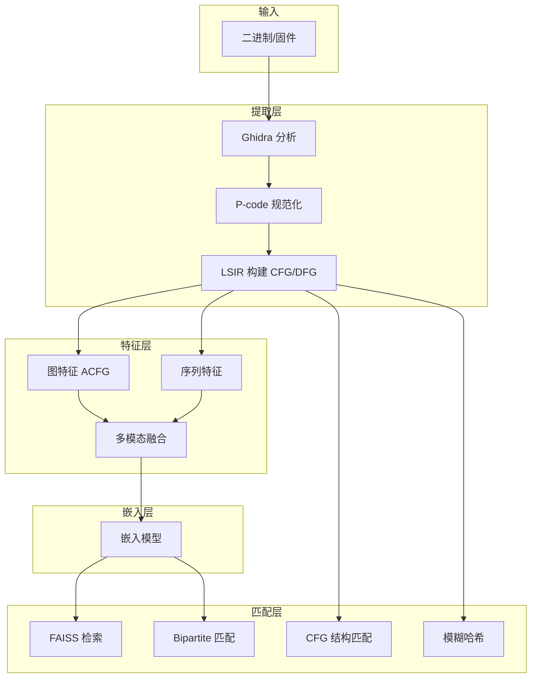

# SemPatch 设计文档

## 开发流程强制规范

1. **写任何代码前**必须完整阅读 `memory-bank/@architecture.md`（包含完整数据结构）
2. **写任何代码前**必须完整阅读 `memory-bank/@design-document.md`
3. **每完成一个重大功能或里程碑后**，必须更新 `memory-bank/@architecture.md`

---

## 一、技术栈与数据集

### 1.1 基础工具与框架

| 类别 | 工具/库 | 说明 | 当前状态 |
|------|---------|------|----------|
| 反汇编与 CFG 提取 | Ghidra | 开源，支持 P-Code 中间表示 | 已集成 |
| 中间表示 | Ghidra P-Code | 消除指令集架构差异 | 已用 |
| 图神经网络 | PyTorch + PyG/DGL | 处理 CFG、PDG 等图结构 | 部分实现（MultiModalFusionModel） |
| 序列模型/Transformer | HuggingFace / 自行实现 | 指令序列建模 | 部分实现 |
| 相似度检索 | FAISS | 大规模向量检索；可选，diff_faiss 策略需要 | 已实现 |
| 特征工程 | Capstone / Ghidra | 辅助归一化 | P-code 规范化已实现 |
| 实验管理 | W&B / TensorBoard | 记录实验 | 待接入 |
| 动态分析 | Unicorn / QEMU / angr | 可选，Trex 风格轨迹 | 未用 |

### 1.2 数据集

| 数据集 | 简介 | 获取方式 | 优先级 |
|--------|------|----------|--------|
| **BinKit** | 8 架构×6 优化×23 编译器，约 37 万二进制 | [SoftSec-KAIST/BinKit](https://github.com/SoftSec-KAIST/BinKit)，预编译从 Google Drive | 高（主要评估基准）；调参对比目录见根目录 [`benchmarks/dev_binkit/`](../benchmarks/dev_binkit/) |
| **固化评测基准** | `benchmarks/smoke`（pytest / `eval_two_stage` 冒烟）、`dev_binkit`（固定 seed 划分）、`real_cve`（`eval_bcsd --mode cve`） | 见 [`benchmarks/README.md`](../benchmarks/README.md)、`make eval-smoke` / `eval-dev` / `eval-real` | 高（可复现尺子） |
| **自备漏洞 ELF** | CVE/1-day 向评估：用户收集二进制 + CVE 映射，走 `docs/VULNERABILITY_LIBRARY.md` | 无强制单一来源；**.arrow 等不能替代 ELF** | 高（产品评估路径） |
| **FirmVulLinker** | 54 固件、74 漏洞，固件级 | [a101e-lab/FirmVulLinker](https://github.com/a101e-lab/FirmVulLinker) | 中 |
| **BinaryCorp** | jTrans 配套，BCSD 对比 | [vul337/jTrans](https://github.com/vul337/jTrans) | 中 |
| **Trex** | 动态语义评估 | [CUMLSec/trex](https://github.com/CUMLSec/trex) | 可选 |

---

## 二、目录结构与模块职责

### 2.1 模块化原则

- **多文件、多模块**：禁止单体巨文件；单文件建议不超过 300 行，超出时拆分为子模块
- **职责边界**：各模块仅承担其定义范围内的职责，避免重叠与越界

### 2.2 推荐目录规范

```
SemPatch/
├── sempatch.py                # 唯一推荐产品 CLI（子命令 match / compare legacy / unpack / extract）
├── memory-bank/
│   ├── @architecture.md
│   ├── @design-document.md
│   └── @implementation-plan.md
├── src/
│   ├── cli/                   # CVE 匹配生产线、TwoStage 报告（产品路径）
│   ├── frontend/              # Ghidra 调用、脚本
│   ├── dag/                   # DAG 编排（节点、执行器、构建器）
│   ├── utils/                 # IR 构建、特征提取、规范化
│   │   └── feature_extractors/  # graph, sequence, fusion
│   ├── features/              # 嵌入推理、模型
│   └── matcher/               # 相似度、FAISS、bipartite
├── scripts/                   # 根目录 *.py 为侧链转发桩
├── scripts/sidechain/         # 训练、评估、库构建等（非产品入口）
├── data/                      # 数据集、漏洞库（默认 gitignore）
├── benchmarks/                # 固化评测路径：smoke / dev_binkit / real_cve
├── docs/                      # 流水线设计、构建说明
└── paper/                     # 综述、论文
```

### 2.3 模块职责边界

| 模块 | 职责 | 最大允许职责 |
|------|------|--------------|
| cli | CVE 匹配生产线编排、TwoStage 报告 API | 不含 DAG 节点实现；可 subprocess 调侧链构建脚本 |
| frontend | 二进制 → lsir_raw | 仅负责 Ghidra 调用与脚本执行 |
| utils | lsir_raw → LSIR、特征 | IR 构建、规范化、特征提取（不包含模型推理） |
| features | 特征 → 向量嵌入 | 模型定义与推理，不含 DAG 编排 |
| matcher | 向量/哈希 → Top-K 匹配 | 相似度计算与检索，不含特征提取 |
| dag | 串接各模块为可配置流水线 | 节点定义与调度，不含业务逻辑实现 |

### 2.4 文件行数清单（需关注）

| 文件 | 行数 | 说明 |
|------|------|------|
| src/dag/builders/ | 各子文件 ≤203 | 已拆分为 fusion、traditional、unpack、ghidra |
| src/utils/ghidra_runner.py | 186 | 已拆分，辅助逻辑在 _ghidra_helpers.py |

---

## 三、流程结构

### 3.1 主流程



**注（5.1 / 当前实现）**：图中特征层的「图特征 → 多模态融合」在 **semantic_embed / fusion** 策略下对应 **`fuse_features` 的 `graph`（CFG）与 `dfg`（数据流子图）**；二者在 `MultiModalFusionModel` 内拼接融合后再与序列跨模态注意力。设计见 [`docs/dfg_fusion_design.md`](../docs/dfg_fusion_design.md)。

### 3.2 策略与节点映射

| 策略 | 节点序列 |
|------|----------|
| semantic_embed | ghidra → lsir_build → feature_extract → embed → load_db → diff_bipartite |
| fusion | ghidra → lsir_build → feature_extract → embed → load_db → diff_bipartite |
| graph_embed | ghidra → lsir_build → acfg_extract → embed → load_db → diff_faiss |
| traditional_fuzzy | ghidra → lsir_build → fuzzy_hash → load_db(fuzzy) → diff_fuzzy |
| traditional_cfg | ghidra → lsir_build → load_db(lsir) → cfg_match |

---

## 四、解决思路与路线图

### 4.1 当前聚焦

**5.1 多维语义深度融合** + **5.3 架构中立表示**（与 README、`TODO.md` 一致）

- **5.1（已实现）**：**CFG 图模态** + **P-code 序列（含跳转语义）** + **跨模态注意力** → 函数嵌入（见 `MultiModalFusionModel` 与 `fuse_features` 的 `graph` / `sequence`）。
- **5.1（已实现，DFG 嵌入路径）**：**DFG** 经 `fuse_features` 写入 `multimodal.dfg`，由 `MultiModalFusionModel` 独立 DFG 分支与 CFG 图嵌入融合；阶段 H 分步验收见 `memory-bank/@prototype-survey-alignment-plan.md` 与 `memory-bank/progress.md`「阶段 H 实施与验证记录」。训练开关：`train_multimodal.py --use-dfg`；推理/Demo：`--use-dfg-model` 或检查点 `meta` 推断。
- **5.3**：P-code 规范化为默认路径；可选汇编归一化见 Phase 1.2。

### 4.2 方案 A：两阶段「粗筛-精排」框架（对应 survey 5.2）

- **目标**：在保持可扩展性的同时提升检测精度
- **扩展方式**：`matcher/` 下增加两阶段检索器；`features/` 区分粗筛/精排模型；第一阶段用 SAFE 或轻量 CNN，第二阶段用 jTrans 或 GNN 重排序

### 4.3 方案 B：基于架构中立表示的学习（对应 survey 5.3）

- **目标**：实现跨架构通用性
- **扩展方式**：扩展 `utils/pcode_normalizer.py`；可选 `utils/asm_normalizer.py` 汇编归一化路径；与 VEX IR、CRABS-former 归一化汇编路线对比
- **调研笔记**：汇编侧选项、与 P-code 分工及建议接入点见 [`docs/asm_normalization_research.md`](../docs/asm_normalization_research.md)

### 4.4 方案 C：多维语义深度融合（对应 survey 5.1）

- **总目标**：融合 **CFG、DFG、序列** 等多维信息，得到更稳健的跨架构表示。
- **当前已实现**：**CFG + DFG 槽位 + 序列** 的多模态融合与跨模态注意力（`utils/feature_extractors/fusion.py`、`features/models/multimodal_fusion.py`）；**孪生 / 对比训练** 与 `embed_batch` / 两阶段精排推理路径已落地；DFG 分支可通过 `--use-dfg` 训练并在检查点 `meta` 中记录（见 `memory-bank/progress.md` 阶段 H）。

### 4.5 5.1 轻量消融（工程对照）

用于 survey 5.1「序列 vs 图+序列」的**管线级**冒烟对照（**两套不同模型结构**，非同一 checkpoint 内开关消融）：

| 对比含义 | 命令入口（合成数据各 1 epoch 示例） |
|----------|-------------------------------------|
| 偏「仅序列」训练/嵌入族 | `PYTHONPATH=src python scripts/train_safe.py --synthetic --epochs 1`（与粗筛 `embed_batch_safe` 同族） |
| CFG + 序列 + 跨模态（无 DFG 子模块） | `PYTHONPATH=src python scripts/train_multimodal.py --synthetic --epochs 1 --no-use-dfg` |
| 含 DFG 子模块（合成数据带 `multimodal.dfg`） | `generate_synthetic_features.py --with-dfg` + `train_multimodal.py --synthetic --use-dfg ...` |

更完整合成短路径见 [`docs/DEVELOPMENT.md`](../docs/DEVELOPMENT.md) 锚点 `#synthetic-short-path`。

---

## 五、评估计划

### 5.1 评估任务

- **函数配对**：给定查询函数，检索 Top-K 准确率（Recall@K, MRR）
- **1-day 漏洞检测**：以已知漏洞函数查询，在目标固件中检索同源漏洞（Precision/Recall）

### 5.2 挑战性场景

- 跨优化选项（-O0 vs -O3）
- 跨编译器（gcc vs clang）
- 跨架构（x86 vs ARM）
- 代码混淆

### 5.3 对比基线

- Gemini（图神经网络）
- SAFE（序列自注意力）
- jTrans（跳变感知 Transformer）
- Trex（动态轨迹）
- CRABS-former（若开源则加入）

### 5.4 指标

- Recall@1, Recall@5, Recall@10
- MRR (Mean Reciprocal Rank)
- AUC（二分类相似与否）

### 5.5 脚本

- `scripts/build_binkit_index.py`：从 binkit_subset 遍历二进制，用 Ghidra 提取函数列表，生成 data/binkit_functions.json
- `scripts/build_embeddings_db.py`：从 LSIR 或 lsir_raw 构建 embeddings；支持单文件、`--input-dir`、`--index-file` 批量模式
- `scripts/eval_bcsd.py`：运行 BCSD 评估（Precision@k, Recall@k, MRR）

---

## 六、总结与后续步骤

本节区分 **「CVE 匹配 Demo 交付（M1）」** 与 **「DFG 多维语义融合（阶段 H）」**，避免与 `TODO.md`、`@prototype-survey-alignment-plan.md` 交叉时产生「训练未做 / DFG 已融合」等误读。

### 6.1 CVE 匹配 Demo 交付（M1，当前优先）

分步指令与验收见 **`memory-bank/@prototype-survey-alignment-plan.md` 阶段 B** 与根目录 **`TODO.md` Phase 0**。

1. **契约与样例**：`docs/DEMO.md`（或 README 专节）；漏洞库 embeddings JSON 含可选 `cve` 列表。
2. **单一入口**：如 `scripts/demo_cve_match.py`（或等价命名），固定走 **`TwoStagePipeline`**；打印配置 / 版本摘要便于复现。
3. **一致性与报告**：查询侧与库侧同一 `embed_batch` 与权重约定；Top-K 结果中 `cve` 显式列出或 `[]`，保留全部原始候选、不去重合并。
4. **文档**：README 显著位置链接 Demo；人工预检清单与一次端到端 exit 0 证据记入 `memory-bank/progress.md`。
5. **回归门槛**：`pytest -m "not ghidra"` **0 failed**（与对齐计划 M1 一致）。

### 6.2 DFG 多维语义融合（阶段 H，在 M1 通过后再启动）

**工程验收与 M2**：按 **`@prototype-survey-alignment-plan.md` 阶段 H** 与 **`TODO.md` Phase 2.4**；**完整勾选与验证记录**见 **`memory-bank/progress.md`「阶段 H 实施与验证记录」**（2026-03-25 起）。

1. **H.1–H.2**：DFG 与 LSIR 审计；[`docs/dfg_fusion_design.md`](../docs/dfg_fusion_design.md) 选定独立 DFG 分支。
2. **H.3–H.7**：`multimodal.dfg`、`MultiModalFusionModel` DFG 分支、训练检查点 `{state_dict, meta}`、精排/Demo 开关、合成消融与文档终态。

**现状摘要**：`fuse_features` 默认写入 `multimodal.dfg`（可空图）；`MultiModalFusionModel(use_dfg=True)` 消费 DFG；旧裸 `state_dict` 检查点仍按无 DFG 结构加载。